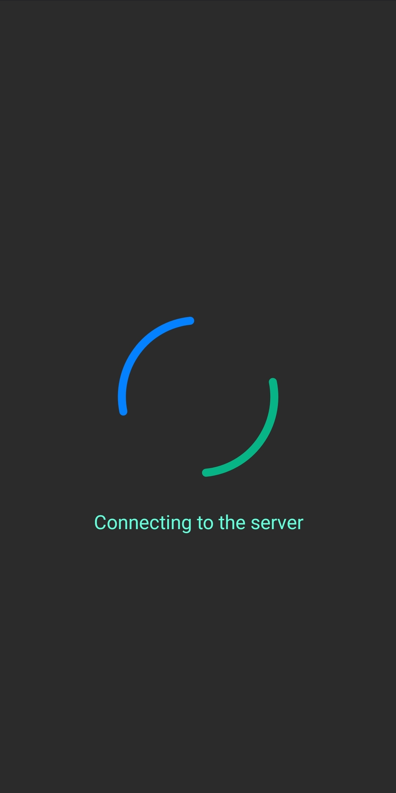
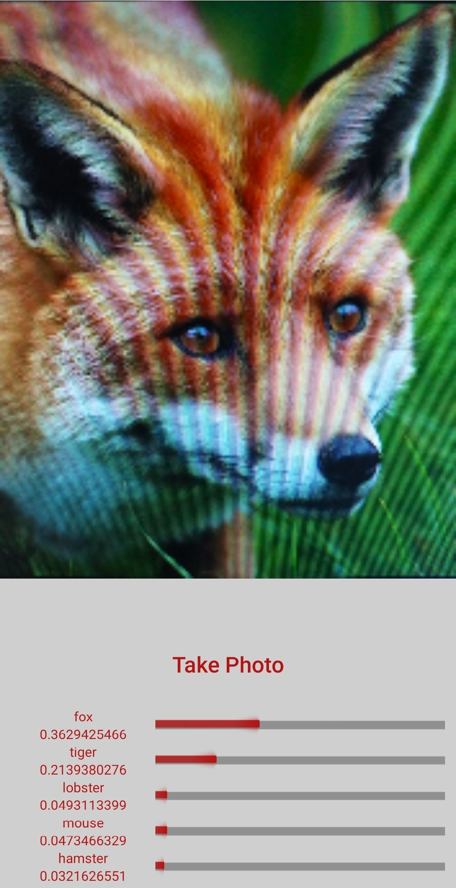
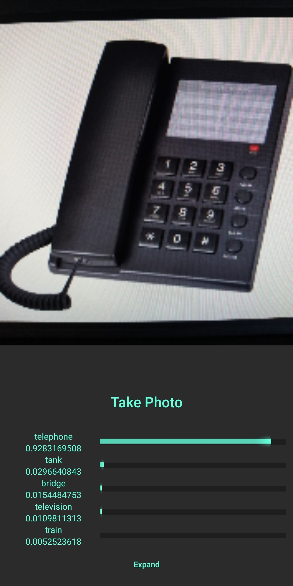
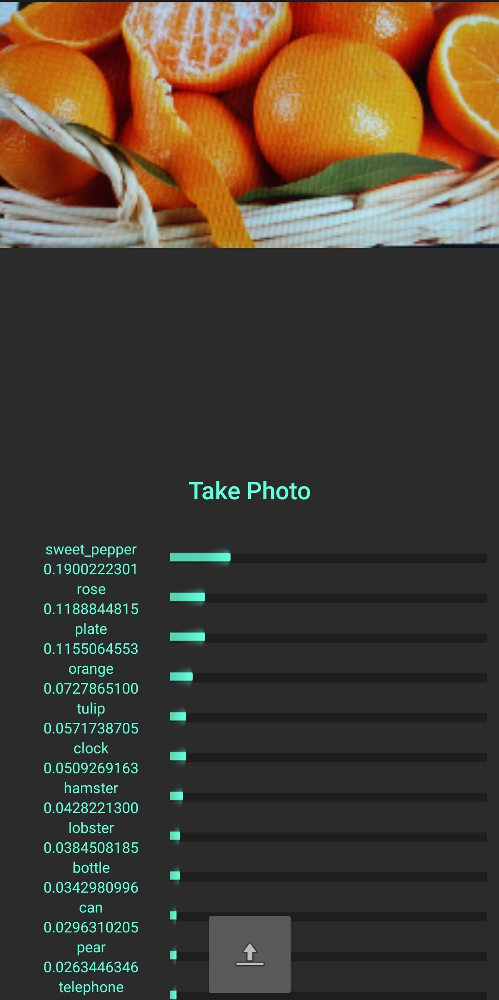

    Oval is an AI image classification tool that runs on Python server and Android App.

# About

This is the android side of the project. This part is responsible for capturing images from the real world and displaying the predictions from server.

# Flow

At first client will try to connect to the server. If successful client will be redirected to the main page where they will be able to take a picture, said picture will be displayed and predictions will be displayed underneath. At first only 5 (most certain) predictions are shown, but client can at any time click the `Expand` button to see all 100 predictions.

# Examples

        

            </img>
            
Connecting to the server

        

        

            </img>
            
Certain fox predictions with day mode UI

        

        

            </img>
            
Certain telephone predictions with night mode UI

        

        

            </img>
            
Uncertain oranges predictions

        

    

# Licensing

This project is licensed under the MIT License. See the LICENSE file for details.

Any contributions and/or suggestions are welcomed
